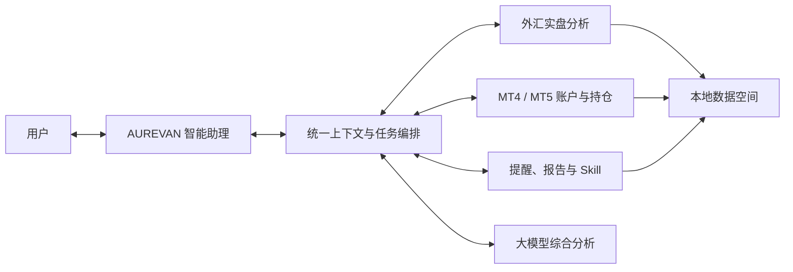

# AUREVAN · 全域投资智能助理

> 一个持续盯守专业分析工具与交易账户、主动整理结论并在需要时提醒用户的本地优先型桌面智能助理。

[产品案例](docs/product-case.md) · [系统架构](docs/architecture.md) · [数据契约](docs/data-contracts.md) · [验证记录](docs/verification.md) · [隐私与安全](docs/privacy-and-safety.md)

## 它解决什么问题

投资者同时使用银行外汇、MetaTrader 和不同专业分析工具时，需要反复打开多个界面、核对数据并判断哪些变化值得处理。AUREVAN 将这些工具组织为后台的“专业分析部门”，用户只需要与一个助理交流。

它不是另一个展示行情的仪表盘，也不替用户自动交易。它负责：

- 持续读取已连接工具的真实持仓、账户、事件与分析结论；
- 把不同来源整理为统一、可追溯的上下文；
- 主动提出需要用户关注的变化，减少重复查看工具的时间；
- 在用户提问时，结合当前工具、账户、品种和页面状态给出分析；
- 对涉及交易执行的动作保留明确授权边界。

## 产品定位

**AUREVAN 始终是唯一与用户交流的“人”；专业分析工具是它背后的分析部门。**

## 已实现的核心体验

### 1. 统一助理对话

主对话与专业分析工作区共用同一套上下文构建逻辑。用户提问时，系统会自动补充当前工具、账户、品种和页面信息，避免同一个问题在不同入口得到互相矛盾的结论。

### 2. 智能分析工作区

已接入的专业工具集中在“智能分析”入口。选择外汇实盘分析后，可进入其原生工作区查看资产、币种分析、交易流水和 AI 分析结论；需要综合判断时，由 AUREVAN 在当前上下文中继续对话。

### 3. 真实账户与持仓读取

MT4 与 MT5 已通过统一 Bridge 接入 AUREVAN，支持多终端、多经纪商和多账户的连接模型，并可读取账户、持仓、挂单、保证金与历史成交。MT5 演示账户已完成端到端联调验证。

### 4. 主动提醒而非重复刷屏

持仓风险、工具异常、数据陈旧和重大变化会进入统一提醒流程。同一事项发生更新时更新原事项；用户明确选择继续观察后，只有状态发生实质变化才再次提醒。

### 5. 自动报告与 Skill

晨报、日报和周报按偏好自动生成。没有有效工具快照时不会生成伪报告；数据恢复后只在当天补试，不跨天补发已经失去时效的内容。

### 6. 本地优先与人工授权

交易数据、模型密钥与工具运行数据保存在本机。AUREVAN 默认只读盯守和分析，不自动执行交易；需要操作权限的任务必须经过用户明确授权。

## 专业能力接入状态

| 专业部门 / 数据源 | 当前状态 | 在 AUREVAN 中的定位 |
| --- | --- | --- |
| 外汇实盘智能分析 | 已完成并接入 | 提供银行现汇持仓、牌价、交易与品种分析 |
| MT4 / MT5 | 已完成统一 Bridge 接入 | 提供交易账户、持仓、挂单、保证金与历史成交 |
| 外汇保证金智能分析 | 建设中，尚未接入 | 独立专业分析部门；完成后沿用相同工具契约接入 |

建设中的工具不会计入当前已实现功能或测试结果。

## 关键产品决策

| 问题 | 设计选择 | 原因 |
| --- | --- | --- |
| 多个工具是否各自提供聊天入口 | 统一由 AUREVAN 对话 | 避免上下文割裂和结论不一致 |
| 专业工具是否重写进助理核心 | 随应用发布、进程与模块隔离 | 保留专业能力，降低耦合和重复开发 |
| 参考行情是否参与交易判断 | 仅供观察 | 不混淆参考行情与真实账户数据 |
| 异常是否要求用户逐条确认 | 状态驱动，持续盯守 | 降低无意义操作和提醒疲劳 |
| 数据过期时是否继续生成报告 | 停止生成结论并等待有效快照 | 防止用空数据或旧数据误导用户 |
| 是否自动下单 | 默认不执行 | 投资决策与交易授权始终由用户掌握 |

## 工程实现摘要

- Python 服务与 SQLite 本地存储；
- Web 桌面工作台与 macOS 应用封装；
- 工具适配器、MCP 通信与专业部门独立进程；
- OpenAI-compatible 模型接入及故障切换；
- 本地精确查询与大模型分析分流；
- 敏感字段裁剪、访问令牌、文件权限与数据清理；
- 自动测试、冒烟测试、MCP 只读测试与桌面打包验证。

## 工程验证

当前版本在合并前完成 **316 项自动化测试**，并覆盖：

- 助理对话与上下文一致性；
- 报告生成、数据时效与跨天边界；
- 外汇实盘专业工具打包及 Web 工作区；
- MT4/MT5 账户、终端与只读数据链路；
- 提醒去重、状态更新和授权任务；
- 登录、访问令牌、敏感字段与本地存储；
- macOS 启动、版本识别和旧进程恢复。

更完整的验收说明见 [验证记录](docs/verification.md)。

仓库同时提供两份经过脱敏的工程示例：

- [助理上下文样例](examples/assistant-context.example.json)：展示工具、账户、品种、时效和模型事实边界如何组织；
- [提醒状态机](examples/alert-state-machine.md)：展示提醒去重与重新触达的业务规则。

## 仓库说明

这是 AUREVAN 的**公开产品与工程案例仓库**，用于说明产品定位、架构决策和验证结果。仓库不包含：

- 私有业务源码与模型提示词；
- API Key、OAuth 密钥或本地访问令牌；
- 真实交易账号、持仓、流水和个人数据；
- 可直接执行交易的组件或接口。

产品名称、界面与文档版权归项目作者所有。未经许可，不得将本仓库内容用于冒充官方产品或误导性商业宣传。
