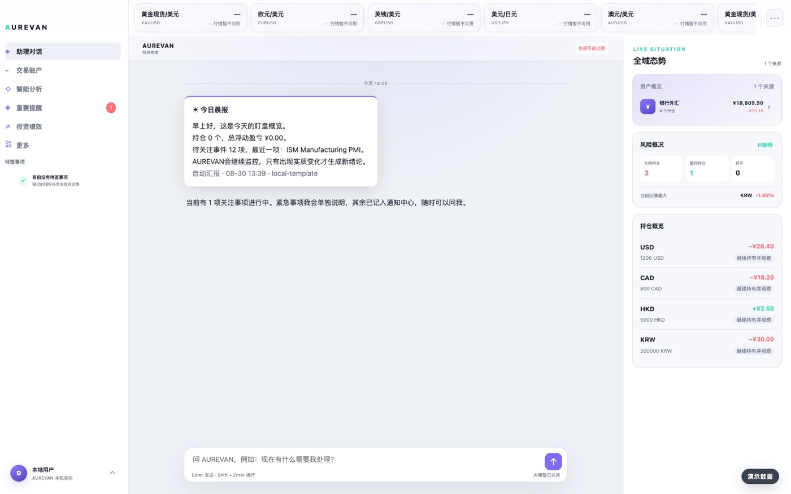
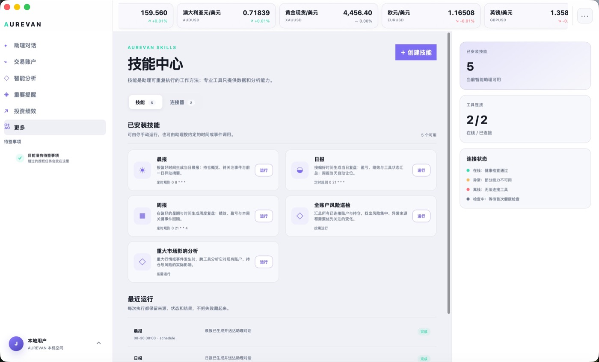
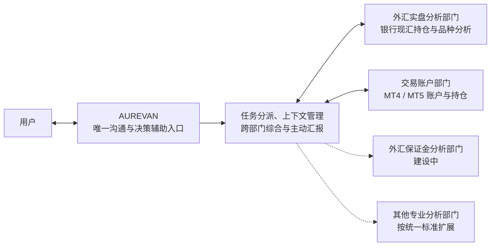
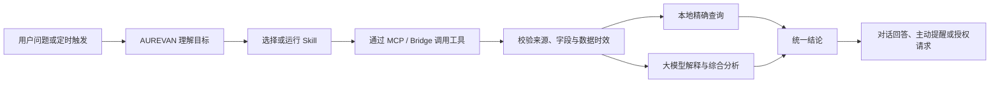

# AUREVAN · 全域投资智能助理

> 一个持续盯守专业分析工具与交易账户、主动整理结论并在需要时提醒用户的本地优先型桌面智能助理。

[产品案例](docs/product-case.md) · [助理与专业部门](docs/assistant-and-departments.md) · [系统架构](docs/architecture.md) · [Skill 与连接器](docs/skills-and-connectors.md) · [验证记录](docs/verification.md)

## 产品截图

以下界面使用脱敏演示数据，不包含真实交易账号、持仓或模型密钥。

### 1. 助理对话与全域态势

### 2. Skill 与连接器

## 30 秒看懂这个项目

| 维度 | 已完成的代表性能力 |
| --- | --- |
| 产品 | 用一个拟人化助理统一承接多工具盯守、主动提醒、综合分析与授权任务，减少用户反复查看工具的成本 |
| AI | 结构化事实与大模型分析分层；主对话和专业工作区共享上下文；缺数据时明确降级，不让模型补造事实 |
| 架构 | Skill 负责任务方法，MCP / Bridge 负责连接工具，专业工具独立运行，新增工具不侵入助理核心 |
| 工程 | macOS 桌面封装、本地数据空间、MT4/MT5 Bridge、状态驱动提醒、自动报告、MT5 授权交易与 322 项自动化测试 |

这不是在行情面板上增加一个聊天框，而是把**工具连接、任务编排、事实校验、模型分析、主动触达和人工授权**组织成一条可运行的产品链路。

## 它解决什么问题

投资者同时使用银行外汇、MetaTrader 和不同专业分析工具时，需要反复打开多个界面、核对数据并判断哪些变化值得处理。AUREVAN 将这些工具组织为后台的“专业分析部门”，用户只需要与一个助理交流。

它不是另一个展示行情的仪表盘，也不会绕过用户自动交易。它负责：

- 持续读取已连接工具的真实持仓、账户、事件与分析结论；
- 把不同来源整理为统一、可追溯的上下文；
- 主动提出需要用户关注的变化，减少重复查看工具的时间；
- 在用户提问时，结合当前工具、账户、品种和页面状态给出分析；
- 对涉及交易执行的动作先完成参数预检，再请求一次性明确授权；授权后由已登录的 MT5 终端执行。

## 产品定位

**AUREVAN 始终是唯一与用户交流的“人”；专业分析工具是它背后的分析部门。**

### “一个助理 + 多个专业部门”架构

- **用户面对的是助理，不是工具目录**：无需判断问题应该交给哪个系统；
- **AUREVAN 像总协调人**：理解目标、选择部门、组合结果，并以一份结论回复；
- **专业部门专注自己的领域**：维护领域模型、计算逻辑、数据和原生分析工作区；
- **深度分析时进入部门工作区**：用户可以查看原始依据，但提问与跨账户判断仍由 AUREVAN 承接；
- **接入新部门不会增加新的聊天机器人**：前台交互保持不变，后台能力持续扩展。

这里的“部门”不是营销命名，而是实际的模块与运行边界。专业工具源码随主项目开发、测试和发布，但独立进程运行、使用独立数据目录，通过统一契约向 AUREVAN 提供能力，不能直接读写助理主库。详见 [助理与专业部门架构](docs/assistant-and-departments.md)。

## 一次任务如何完成

以下流程说明 AUREVAN 为什么不是普通的模型问答外壳：

- 数值、持仓、账户和流水来自工具事实，不交给模型猜测；
- 原因、影响、风险和跨账户关系由模型在受控上下文中分析；
- 数据过期、字段缺失或工具离线时，链路停止生成实时结论；
- 涉及交易执行时，先以 MT5 `OrderCheck` 预检账户、品种、方向、数量和保证金，再使用与订单指纹绑定的短时一次性授权；系统不会自行下单或失败后自动重试。

## 已实现的核心体验

### 1. 统一助理对话

主对话与专业分析工作区共用同一套上下文构建逻辑。用户提问时，系统会自动补充当前工具、账户、品种和页面信息，避免同一个问题在不同入口得到互相矛盾的结论。

### 2. 智能分析工作区

已接入的专业工具集中在“智能分析”入口。选择外汇实盘分析后，可进入其原生工作区查看资产、币种分析、交易流水和 AI 分析结论；需要综合判断时，由 AUREVAN 在当前上下文中继续对话。

### 3. 真实账户与持仓读取

MT4 与 MT5 已通过统一 Bridge 接入 AUREVAN，支持多终端、多经纪商和多账户的连接模型，并可读取账户、持仓、挂单、保证金与历史成交。MT5 还实现了“订单预检 → 参数确认 → 一次性授权 → 终端执行 → 结果回传”的受控交易链路；演示账户已完成端到端预检验证，验收过程未发送真实订单。

### 4. 主动提醒而非重复刷屏

持仓风险、工具异常、数据陈旧和重大变化会进入统一提醒流程。同一事项发生更新时更新原事项；用户明确选择继续观察后，只有状态发生实质变化才再次提醒。

### 5. 自动报告与 Skill

晨报、日报、周报、全账户风险巡检和重大市场影响分析构成首批 5 个内置 Skill。用户还可以用自然语言创建、启用、停用、运行和删除个人 Skill。没有有效工具快照时不会生成伪报告；数据恢复后只在当天补试，不跨天补发已经失去时效的内容。

### 6. 本地优先与人工授权

交易数据、模型密钥与工具运行数据保存在本机。AUREVAN 默认只读盯守和分析；MT5 交易只有在预检通过、订单参数固定且用户逐笔明确授权后才可执行，授权不可复用，也不会自动重试。

## 专业部门、Skill 与 MCP 连接器

三者不是重复功能，而是 Agent 系统中不同层次的能力：

| 组件 | 解决的问题 | 当前例子 |
| --- | --- | --- |
| AUREVAN | 理解用户目标、选择能力、组织工具并交付统一结论 | “我的加元盈利为什么下降？” |
| 专业部门 | 沉淀某个领域的数据、规则、计算和原生分析工作区 | 外汇实盘分析、MT4/MT5 账户 |
| Skill | 定义完成一类任务的方法、步骤、触发条件与输出格式 | 晨报、全账户风险巡检、重大市场影响分析、个人 Skill |
| MCP / Bridge | 标准化连接外部工具和真实数据，隐藏各工具的接口差异 | 外汇实盘分析、MT4/MT5 Bridge |

例如“检查全部账户风险”不是把一个固定模板展示给用户：AUREVAN 运行风险巡检 Skill，Skill 通过连接器读取多个账户与专业工具，统一时效和字段后，再由模型综合解释风险。未来增加新工具时，主要新增工具适配与契约，不需要重新开发一套助理对话。

## 专业能力接入状态

| 专业部门 / 数据源 | 当前状态 | 在 AUREVAN 中的定位 |
| --- | --- | --- |
| 外汇实盘智能分析 | 已完成并接入 | 提供银行现汇持仓、牌价、交易与品种分析 |
| MT4 / MT5 | 已完成统一 Bridge 接入 | 提供交易账户、持仓、挂单、保证金与历史成交；MT5 支持预检与逐笔授权执行 |
| 外汇保证金智能分析 | 建设中，尚未接入 | 独立专业分析部门；完成后沿用相同工具契约接入 |

建设中的工具不会计入当前已实现功能或测试结果。

## 关键产品决策

| 问题 | 设计选择 | 原因 |
| --- | --- | --- |
| 多个工具是否各自提供聊天入口 | 统一由 AUREVAN 对话 | 避免上下文割裂和结论不一致 |
| 专业工具是否重写进助理核心 | 随应用发布、进程与模块隔离 | 保留专业能力，降低耦合和重复开发 |
| 参考行情是否参与交易判断 | 仅供观察 | 不混淆参考行情与真实账户数据 |
| 异常是否要求用户逐条确认 | 状态驱动，持续盯守 | 降低无意义操作和提醒疲劳 |
| 数据过期时是否继续生成报告 | 停止生成结论并等待有效快照 | 防止用空数据或旧数据误导用户 |
| 是否自动下单 | 不自动下单；MT5 仅在预检后逐笔授权执行 | 投资决策、订单参数与交易授权始终由用户掌握 |

## 架构优势

### 前台只有一个助理，后台可以持续扩展

用户不需要理解 MCP、工具端口或数据格式，也不需要在多个机器人之间选择。新专业工具作为后台部门接入，AUREVAN 仍是唯一交互入口。

### 精确数据与生成式分析分层

系统不会让大模型负责计算真实余额、持仓或盈亏。事实查询、单位归一、时间校验在本地完成，大模型只处理解释、比较、归因与建议，从架构上降低幻觉影响。

### 统一契约隔离工具差异

银行现汇、MT4/MT5 和专业分析工具的数据结构不同。适配层将它们归一为工具、账户、持仓、事件和结论等对象，使 Skill 和对话层不依赖某个经纪商或单一工具实现。

### 状态机代替轮询刷屏

提醒以事项状态变化为触发条件，而不是每次轮询都创建新通知。它能区分首次触发、持续观察、实质变化、恢复与解除，兼顾主动性和低打扰。

### 本地优先但保留模型能力

完整交易数据、工具日志和密钥留在本机；只有完成当前问题所需的最小摘要进入模型上下文。这样既能使用大模型做综合分析，又不必把整个账户数据库上传到外部服务。

## 代表性技术难点

| 难点 | 处理方式 | 结果 |
| --- | --- | --- |
| 多个对话入口回答不一致 | 建立共享上下文构建器，显式注入工具、账户、品种、页面和数据时间 | 主对话与专业工作区使用同一事实边界 |
| 缺失时间被误判为“零持仓” | 引入 `fresh / stale / unknown / offline` 四态数据契约 | 过期或不完整数据不再生成虚假实时结论 |
| 工具越多，核心代码越耦合 | 使用 ToolAdapter、MCP / Bridge 和独立专业部门进程 | 新部门按契约接入，不复制聊天和业务代码 |
| 轮询产生重复提醒 | 以稳定事项键和状态迁移更新原提醒 | 只有风险、方向或可用性发生实质变化才重新触达 |
| 多个 MT4/MT5 终端与账户难识别 | 将终端实例、经纪商、平台和账户组成稳定身份 | 支持多终端、多经纪商、多账户与终端换号场景 |
| 交易执行既要可用又不能越权 | `OrderCheck` 预检、不可变订单指纹、短时一次性授权与结果回传 | MT5 可受控执行，但模型、定时任务和失败重试均不能绕过用户授权 |
| 桌面打包后服务版本与端口不稳定 | 增加进程健康检查、动态回环端口、旧进程识别和启动恢复 | 降低打开旧页面、端口冲突和启动超时问题 |
| 模型需要数据但不能接触全部隐私 | 本地查询先裁剪事实，外发最小摘要并脱敏敏感标识 | 保留综合分析能力，同时缩小数据暴露面 |

## 工程实现摘要

- Python 服务与 SQLite 本地存储；
- Web 桌面工作台与 macOS 应用封装；
- 工具适配器、MCP 通信与专业部门独立进程；
- OpenAI-compatible 模型接入及故障切换；
- 本地精确查询与大模型分析分流；
- 敏感字段裁剪、访问令牌、文件权限与数据清理；
- 自动测试、冒烟测试、MCP 只读测试与桌面打包验证。

## 工程验证

当前版本在合并前完成 **322 项自动化测试**，并覆盖：

- 助理对话与上下文一致性；
- 报告生成、数据时效与跨天边界；
- 外汇实盘专业工具打包及 Web 工作区；
- MT4/MT5 账户、终端与只读数据链路；MT5 订单预检、授权边界与命令回传；
- 提醒去重、状态更新和授权任务；
- 登录、访问令牌、敏感字段与本地存储；
- macOS 启动、版本识别和旧进程恢复。

更完整的验收说明见 [验证记录](docs/verification.md)。

### 功能主张与验证证据

| 主张 | 可核对证据 |
| --- | --- |
| 多入口回答使用同一上下文 | 上下文一致性自动测试、脱敏上下文样例 |
| 旧数据不会冒充实时数据 | `fresh / stale / unknown / offline` 数据契约与边界测试 |
| 主动提醒不会每天重复刷屏 | 提醒状态机示例、去重与实质变化回归测试 |
| 专业工具可随应用运行 | 独立进程健康检查、打包产物和原生工作区冒烟测试 |
| MT4/MT5 不是静态界面演示 | Bridge 账户发现、持仓读取；MT5 `OrderCheck` 端到端预检、订单指纹和一次性授权测试 |
| 交易隐私与执行具有明确边界 | 本地令牌、敏感字段裁剪、文件权限、MT5 预检和逐笔一次性授权验收 |

仓库同时提供两份经过脱敏的工程示例：

- [助理上下文样例](examples/assistant-context.example.json)：展示工具、账户、品种、时效和模型事实边界如何组织；
- [提醒状态机](examples/alert-state-machine.md)：展示提醒去重与重新触达的业务规则。

## 当前边界

- 当前公开仓库是产品与工程案例，不提供私有业务源码；
- MT5 已完成演示账户读取与安全预检链路验证；MT4 使用同一 Bridge 契约完成读取能力实现与自动化验证，当前不宣称具备与 MT5 相同的交易执行链路；
- 外汇保证金智能分析仍在建设中，不计入当前已交付能力；
- AUREVAN 提供辅助分析和风险提示，不替代持牌投资顾问，也不承诺收益。

## 仓库说明

这是 AUREVAN 的**公开产品与工程案例仓库**，用于说明产品定位、架构决策和验证结果。仓库不包含：

- 私有业务源码与模型提示词；
- API Key、OAuth 密钥或本地访问令牌；
- 真实交易账号、持仓、流水和个人数据；
- 可直接执行交易的组件或接口。

产品名称、界面与文档版权归项目作者所有。未经许可，不得将本仓库内容用于冒充官方产品或误导性商业宣传。
