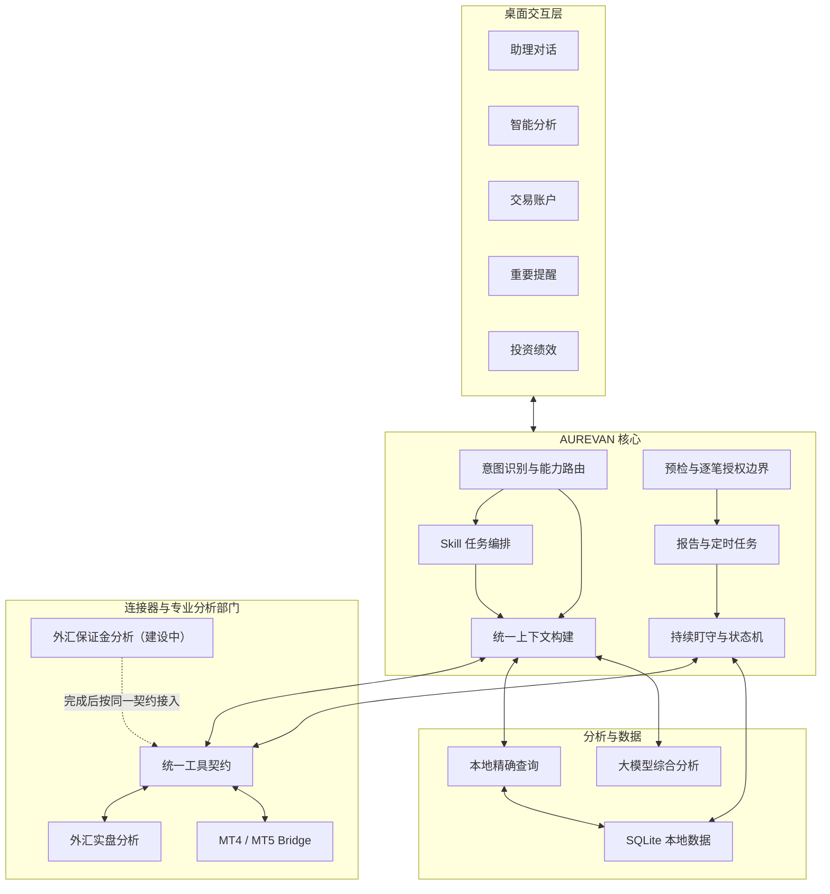

# 系统架构

产品层采用“一个助理 + 多个专业分析部门”的组织方式；本页说明其技术实现。完整产品职责见 [助理与专业分析部门架构](assistant-and-departments.md)。

## 总体结构

## 分层职责

| 层 | 职责 | 不负责 |
| --- | --- | --- |
| AUREVAN | 理解目标、选择路径、维护上下文、交付统一结论 | 不直接伪造工具事实 |
| Skill | 定义任务步骤、触发条件、权限和输出 | 不保存经纪商或工具专有实现 |
| 连接器 | 调用外部工具、归一字段、暴露健康与时效 | 不替用户做最终判断 |
| 专业工具 | 生产领域数据和专业分析结论 | 不各自成为面向用户的独立助理 |
| 模型 | 解释、归因、比较与综合分析 | 不计算或修改真实账户数据 |

## 核心原则

### 统一上下文

所有对话入口必须使用同一套上下文构建器。当前工具、账户、品种、页面和最近有效快照作为结构化上下文传入，避免模型仅依赖用户短句猜测对象。

### 数据与分析分离

持仓数量、账户余额、交易流水和工具状态由本地精确查询返回；原因、影响、风险和建议再交给模型分析。模型不能修改工具事实，也不能把缺失字段推断为零。

### 状态驱动提醒

提醒以“事项”为核心而不是以“每次轮询”为核心。同一事项更新状态和时间，不重复创建卡片；只有跨越风险阈值、方向变化、工具恢复或数据重新有效等实质变化才重新触达。

### 专业部门隔离

专业工具属于同一主项目并随应用发布，但继续在独立进程、模块和数据目录中运行。AUREVAN 通过适配器和 MCP 获取标准化结果，不把工具业务代码复制到对话核心，专业部门也不能直接读写 AUREVAN 主库。

### Skill 与连接器解耦

Skill 只依赖统一工具契约，不直接依赖某个工具的原始字段和接口。一个 Skill 可以组合多个连接器，同一个连接器也可以被对话、报告、提醒和多个 Skill 复用。

### 本地数据边界

数据库、备份、工具日志、模型密钥和交易数据留在用户本机。对模型只发送完成当前问题所需的最小摘要，并在外发前裁剪或脱敏敏感字段。

## 受控交易执行链路

MT5 写操作与只读数据通道分离。订单先经过账户和参数校验，再由终端执行 `OrderCheck`；预检通过后生成不可变订单指纹和短时一次性授权。只有用户确认的同一订单可以进入执行邮箱，终端回传结果后授权立即失效。该链路不允许模型自行批准、定时任务绕过授权或失败后自动重试。MT4 当前只提供读取能力，不宣称与 MT5 执行能力一致。
