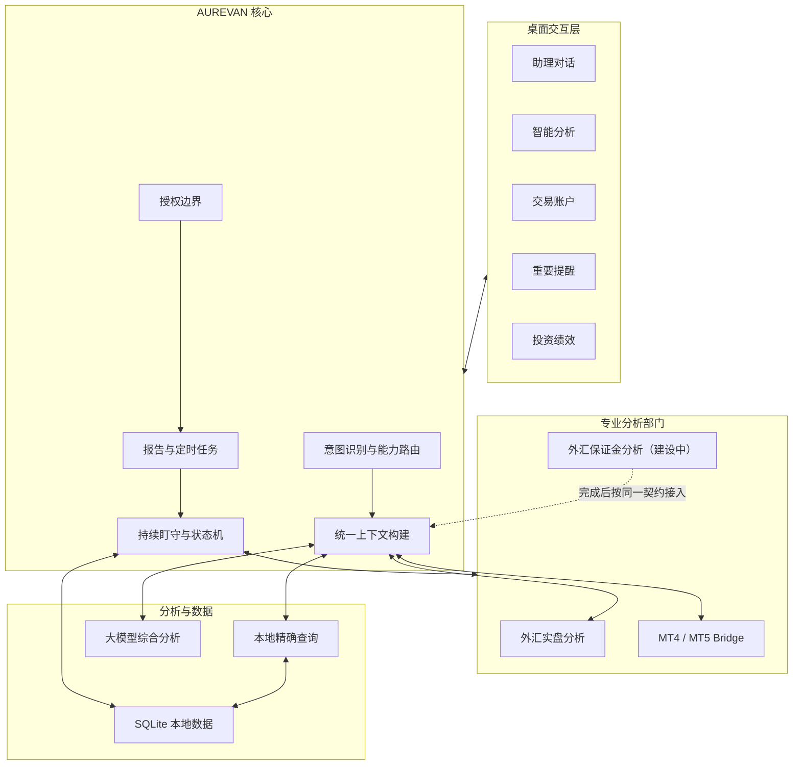

# 系统架构

## 总体结构

## 核心原则

### 统一上下文

所有对话入口必须使用同一套上下文构建器。当前工具、账户、品种、页面和最近有效快照作为结构化上下文传入，避免模型仅依赖用户短句猜测对象。

### 数据与分析分离

持仓数量、账户余额、交易流水和工具状态由本地精确查询返回；原因、影响、风险和建议再交给模型分析。模型不能修改工具事实，也不能把缺失字段推断为零。

### 状态驱动提醒

提醒以“事项”为核心而不是以“每次轮询”为核心。同一事项更新状态和时间，不重复创建卡片；只有跨越风险阈值、方向变化、工具恢复或数据重新有效等实质变化才重新触达。

### 专业部门隔离

专业工具随应用发布，但继续在独立进程与模块中运行。AUREVAN 通过适配器和 MCP 获取标准化结果，不把工具业务代码复制到对话核心。

### 本地数据边界

数据库、备份、工具日志、模型密钥和交易数据留在用户本机。对模型只发送完成当前问题所需的最小摘要，并在外发前裁剪或脱敏敏感字段。
