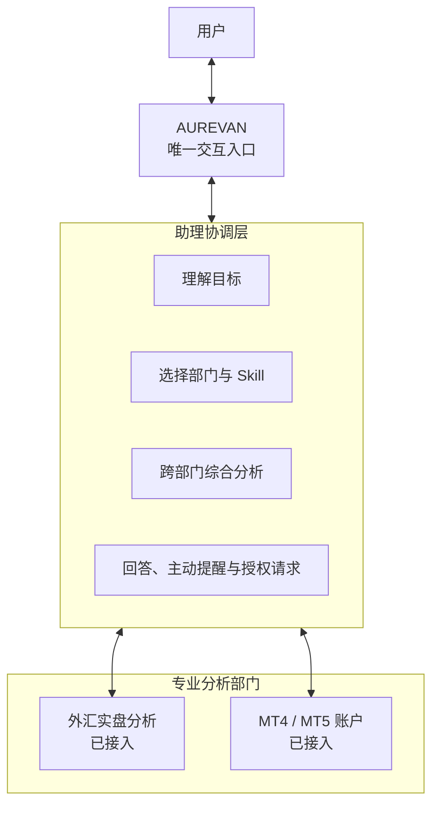
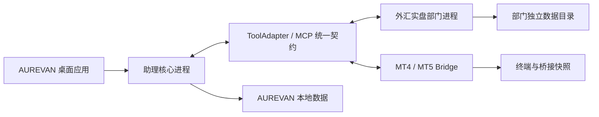

# 助理与专业分析部门架构

## 核心定位

**AUREVAN 始终是唯一和用户交流的“人”；专业分析工具是它背后的专业分析部门。**

这套架构解决的不是“如何在一个页面里放更多工具”，而是工具越来越多以后，如何不把理解、切换和核对成本继续转嫁给用户。

## 产品组织结构

## 各角色负责什么

### AUREVAN

- 接收用户的自然语言目标，而不是要求用户先选工具；
- 识别问题涉及的账户、品种、页面和时间范围；
- 选择适合的 Skill 与专业部门；
- 将多个部门的事实和结论整理为统一上下文；
- 交付一份可追溯的回答，并在需要时主动提醒或申请授权。

### 专业分析部门

- 维护本领域的数据读取、指标计算、业务规则和分析模型；
- 输出标准化健康状态、账户、持仓、行情、事件和分析结论；
- 提供需要深度查看时使用的原生工作区；
- 不自行成为另一个面向用户的助理，不绕过 AUREVAN 发送冲突结论。

## 两种使用深度

### 默认：助理直接交付结果

用户只在主对话提出问题。AUREVAN 自动调用相关部门，校验数据并返回综合结论。绝大多数日常盯守不需要打开专业工具。

### 深入：进入专业部门工作区

用户需要查看币种分析、交易流水或具体指标时，可以从“智能分析”进入对应原生工作区。AUREVAN 保留当前工具、账户、品种和页面上下文，用户仍可通过“问助理”进行跨工具分析。

## 技术运行结构

专业部门属于同一个主项目，可以随 AUREVAN 一起安装，但不是把所有代码揉进一个进程：

关键约束：

- 专业部门不能直接读写 AUREVAN 主库；
- 每个部门有独立健康状态、进程生命周期和数据目录；
- 部门通过统一契约提供数据，不向助理暴露私有表结构；
- 打包只包含运行所需源码与资源，不包含用户数据库、备份、日志和模型密钥。

## 与 Skill、MCP 的关系

- **专业部门**定义领域能力归属，例如外汇实盘分析负责银行现汇数据、规则和原生工作区；
- **MCP / Bridge**定义 AUREVAN 如何发现、调用并读取这些能力；
- **Skill**定义为了完成一次用户任务，应该调用哪些部门、采用什么步骤、何时触发以及如何输出；
- **AUREVAN**负责理解用户目标、选择 Skill、维护跨部门上下文并交付最终结果。

因此，接入一个工具并不等于完成一个 Skill；一个 Skill 也不需要复制工具。二者通过统一契约组合，详细设计见 [Skill 与连接器](skills-and-connectors.md)。

## 为什么这套架构有价值

1. **交互成本不会随工具数量线性增长**：新增部门不新增一个聊天入口；
2. **领域能力可以独立演进**：修改外汇分析逻辑，不需要改动助理对话核心；
3. **跨部门问题有统一答案**：AUREVAN 可以组合多个工具，而不是让用户自己拼结果；
4. **故障可以局部隔离**：一个部门离线不会让整个桌面应用失去基本能力；
5. **发布体验保持完整**：普通用户安装一个应用即可获得已交付部门，无需分别寻找和配置多个项目。

## 示例：一个跨来源问题

用户问：“我的加元盈利为什么下降，其他交易账户有没有相同风险？”

AUREVAN 的处理方式是：

1. 调用外汇实盘分析部门，读取银行现汇持仓、牌价变化与币种结论；
2. 调用 MT4 / MT5 Bridge，核对相关交易账户、持仓与保证金状态；
3. 对账户身份、数据来源和采集时间进行校验；
4. 区分汇率驱动、仓位变化与数据异常；
5. 汇总为一份面向用户的跨账户影响分析。
