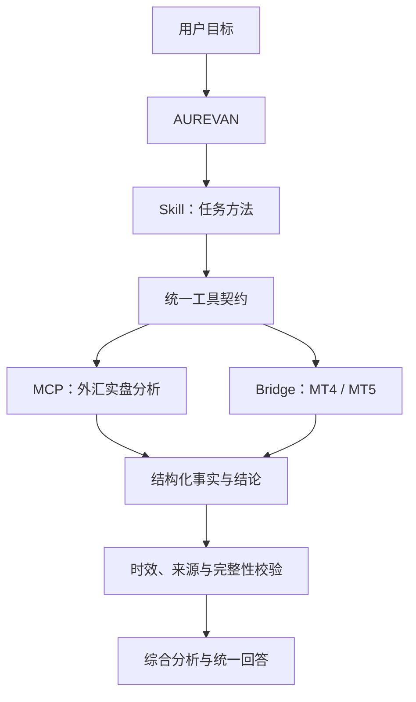

# Skill 与连接器设计

这部分对应 AUREVAN 的 Agent 能力扩展层：Skill 提供可复用工作流，MCP / Bridge 提供标准工具调用，专业部门提供领域事实与分析能力。

## 为什么要分成两层

专业工具回答“我能提供什么事实和专业结论”，Skill 回答“为了完成用户这件事，应该按什么步骤组织这些能力”。把二者分开后，新工具可以复用已有 Skill，新 Skill 也可以组合已有工具。

## 当前内置 Skill

| Skill | 用途 | 触发方式 |
| --- | --- | --- |
| 晨报 | 汇总开盘前后需要关注的持仓、事件和工具状态 | 定时或手动 |
| 日报 | 汇总当日盈亏、绩效、交易和状态变化 | 定时或手动 |
| 周报 | 回顾周度绩效、盈亏和关键事件 | 定时或手动 |
| 全账户风险巡检 | 跨已接入账户检查集中风险与异常变化 | 手动、定时或事件触发 |
| 重大市场影响分析 | 判断重大市场事件对实际账户与持仓的影响 | 事件触发或手动 |

用户还可以用自然语言创建个人 Skill，并进行启用、停用、运行和删除。个人 Skill 描述任务目标与执行方法，不复制底层工具实现。

## 当前连接器

| 连接器 | 提供的能力 | 边界 |
| --- | --- | --- |
| 外汇实盘分析 MCP | 银行现汇持仓、牌价、交易、事件和品种分析 | 专业工具独立运行，AUREVAN 读取标准化结果 |
| MT4/MT5 Bridge | 账户、持仓、挂单、保证金和历史成交 | 终端负责登录；AUREVAN 不保存交易密码，默认只读 |

## 扩展方式

接入新专业工具时，需要完成四件事：

1. 提供稳定的工具标识和健康状态；
2. 将工具输出适配为统一数据契约；
3. 声明可被哪些 Skill 使用，以及所需权限；
4. 通过时效、异常、脱敏和只读验收。

完成后，主对话、风险巡检和报告系统即可复用该工具，不需要复制新的聊天页面。
