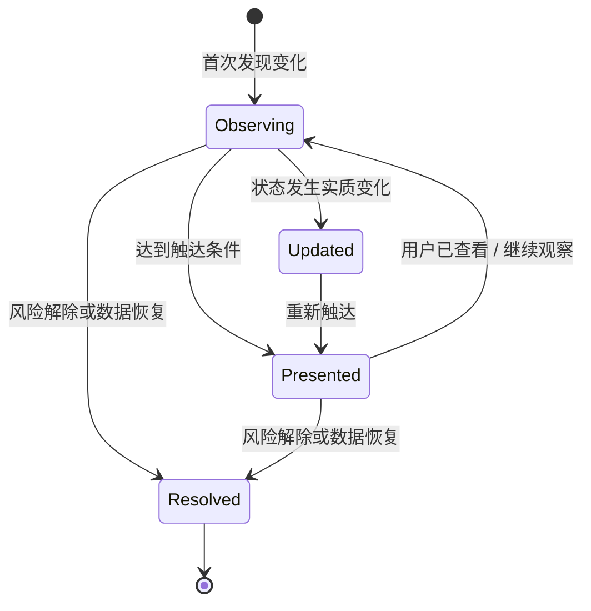

# 提醒状态机示例

公开案例不包含生产代码，下面展示提醒系统的业务状态定义。

```mermaid
stateDiagram-v2
    [*] --> Observing: 首次发现变化
    Observing --> Presented: 达到触达条件
    Presented --> Observing: 用户已查看 / 继续观察
    Observing --> Updated: 状态发生实质变化
    Updated --> Presented: 重新触达
    Observing --> Resolved: 风险解除或数据恢复
    Presented --> Resolved: 风险解除或数据恢复
    Resolved --> [*]
```

## “实质变化”的判定

- 穿越用户设置的风险线；
- 盈亏方向发生变化；
- 工具从在线变为异常，或从异常恢复；
- 数据从有效变为过期，或重新获得有效快照；
- 专业工具结论方向改变；
- 账户、持仓或订单状态发生变化。

仅轮询时间变化、页面刷新或相同结论重复返回，不创建新提醒。

